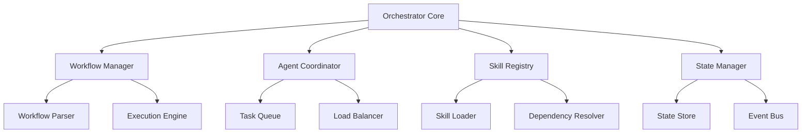

# RestoreAssist Orchestrator Directory Structure

## Project Root Structure

```
RestoreAssist/
├── .claude/                          # Claude-specific configurations
│   ├── orchestrator-framework/       # This documentation
│   ├── commands/                     # Custom slash commands
│   └── skills/                       # Skill definitions
│
├── app/                              # Next.js app directory (React 19)
│   ├── api/                         # API routes
│   │   ├── orchestrator/            # Orchestrator endpoints
│   │   │   ├── workflows/           # Workflow management
│   │   │   ├── skills/              # Skill execution
│   │   │   ├── agents/              # Agent coordination
│   │   │   └── state/               # State management
│   │   ├── auth/                    # Authentication
│   │   ├── reports/                 # Report generation
│   │   ├── estimates/               # Estimate creation
│   │   └── compliance/              # Compliance validation
│   │
│   ├── dashboard/                   # Dashboard pages
│   │   ├── orchestrator/           # Orchestrator UI
│   │   ├── reports/                # Reports management
│   │   └── workflows/              # Workflow builder
│   │
│   └── components/                  # React components
│       ├── orchestrator/           # Orchestrator components
│       ├── reports/                # Report components
│       └── shared/                 # Shared components
│
├── lib/                            # Core business logic
│   ├── orchestrator/              # Orchestrator core
│   ├── skills/                    # Skill implementations
│   ├── agents/                    # Agent definitions
│   ├── workflows/                 # Workflow definitions
│   ├── compliance/                # Compliance engine
│   └── integrations/              # External integrations
│
├── prisma/                        # Database schema
│   ├── schema.prisma             # Main schema
│   ├── migrations/               # Database migrations
│   └── seed.ts                   # Seed data
│
├── tests/                         # Test suites
│   ├── unit/                     # Unit tests
│   ├── integration/              # Integration tests
│   └── e2e/                      # End-to-end tests
│
├── config/                        # Configuration files
│   ├── orchestrator.yaml         # Orchestrator config
│   ├── skills.yaml               # Skills registry
│   └── workflows/                # Workflow definitions
│
└── docs/                          # Documentation
    ├── orchestrator/             # Orchestrator docs
    ├── api/                      # API documentation
    └── deployment/               # Deployment guides
```

## Detailed Component Structure

### 1. Orchestrator Core (`lib/orchestrator/`)

```
lib/orchestrator/
├── index.ts                      # Main orchestrator export
├── orchestrator.ts               # Core orchestrator class
├── workflow-manager.ts           # Workflow management
├── skill-registry.ts             # Skill registration & discovery
├── agent-coordinator.ts          # Agent coordination
├── state-manager.ts              # State management
├── event-bus.ts                  # Event communication
├── queue-manager.ts              # Task queue management
├── scheduler.ts                  # Task scheduling
├── monitoring.ts                 # Performance monitoring
│
├── types/                        # TypeScript definitions
│   ├── workflow.types.ts
│   ├── skill.types.ts
│   ├── agent.types.ts
│   └── state.types.ts
│
├── errors/                       # Custom error classes
│   ├── orchestrator-error.ts
│   ├── skill-error.ts
│   └── workflow-error.ts
│
└── utils/                        # Utility functions
    ├── validators.ts
    ├── transformers.ts
    └── helpers.ts
```

### 2. Skills Directory (`lib/skills/`)

```
lib/skills/
├── index.ts                      # Skills export
├── base-skill.ts                 # Base skill class
├── skill-factory.ts              # Skill creation factory
│
├── assessment/                   # Assessment skills
│   ├── water-damage-assessor.ts
│   ├── mold-assessor.ts
│   ├── structural-assessor.ts
│   ├── photo-analyzer.ts
│   └── measurement-calculator.ts
│
├── documentation/                # Documentation skills
│   ├── report-generator.ts
│   ├── estimate-builder.ts
│   ├── scope-writer.ts
│   ├── summary-creator.ts
│   └── template-processor.ts
│
├── compliance/                   # Compliance skills
│   ├── iicrc-validator.ts
│   ├── s500-compliance.ts
│   ├── s520-compliance.ts
│   ├── insurance-compliance.ts
│   └── safety-validator.ts
│
├── calculation/                  # Calculation skills
│   ├── psychrometric-calculator.ts
│   ├── equipment-calculator.ts
│   ├── cost-calculator.ts
│   ├── drying-time-estimator.ts
│   └── material-quantity.ts
│
├── integration/                  # Integration skills
│   ├── xactimate-connector.ts
│   ├── docusign-handler.ts
│   ├── email-sender.ts
│   ├── storage-manager.ts
│   └── webhook-processor.ts
│
└── ai/                          # AI-powered skills
    ├── damage-analyzer.ts
    ├── text-generator.ts
    ├── image-processor.ts
    ├── recommendation-engine.ts
    └── pattern-recognizer.ts
```

### 3. Agents Directory (`lib/agents/`)

```
lib/agents/
├── index.ts                      # Agents export
├── base-agent.ts                 # Base agent class
├── agent-factory.ts              # Agent creation factory
│
├── specialized/                  # Specialized agents
│   ├── damage-assessment-agent.ts
│   ├── report-generation-agent.ts
│   ├── estimate-creation-agent.ts
│   ├── compliance-check-agent.ts
│   └── quality-assurance-agent.ts
│
├── coordination/                 # Coordination agents
│   ├── master-coordinator.ts
│   ├── workflow-controller.ts
│   ├── resource-allocator.ts
│   └── task-distributor.ts
│
└── monitoring/                   # Monitoring agents
    ├── performance-monitor.ts
    ├── error-handler.ts
    ├── audit-logger.ts
    └── metrics-collector.ts
```

### 4. Workflows Directory (`lib/workflows/`)

```
lib/workflows/
├── index.ts                      # Workflows export
├── base-workflow.ts              # Base workflow class
├── workflow-builder.ts           # Workflow builder utility
│
├── definitions/                  # Workflow definitions
│   ├── restoration-report.yaml
│   ├── emergency-response.yaml
│   ├── routine-inspection.yaml
│   ├── insurance-claim.yaml
│   └── mold-remediation.yaml
│
├── templates/                    # Workflow templates
│   ├── water-damage/
│   │   ├── category-1.yaml
│   │   ├── category-2.yaml
│   │   └── category-3.yaml
│   ├── mold/
│   │   ├── small-area.yaml
│   │   ├── large-area.yaml
│   │   └── hvac-contamination.yaml
│   └── fire/
│       ├── smoke-damage.yaml
│       ├── structural-fire.yaml
│       └── contents-only.yaml
│
└── custom/                       # User-defined workflows
    └── .gitkeep
```

### 5. API Routes (`app/api/orchestrator/`)

```
app/api/orchestrator/
├── workflows/
│   ├── route.ts                 # GET, POST /api/orchestrator/workflows
│   ├── [id]/
│   │   ├── route.ts            # GET, PUT, DELETE workflow
│   │   ├── execute/
│   │   │   └── route.ts        # POST execute workflow
│   │   ├── status/
│   │   │   └── route.ts        # GET workflow status
│   │   └── pause/
│   │       └── route.ts        # POST pause workflow
│
├── skills/
│   ├── route.ts                 # GET, POST /api/orchestrator/skills
│   ├── [id]/
│   │   ├── route.ts            # GET skill details
│   │   ├── execute/
│   │   │   └── route.ts        # POST execute skill
│   │   └── validate/
│   │       └── route.ts        # POST validate skill input
│
├── agents/
│   ├── route.ts                 # GET list agents
│   ├── [id]/
│   │   ├── route.ts            # GET agent details
│   │   ├── assign/
│   │   │   └── route.ts        # POST assign task
│   │   └── status/
│   │       └── route.ts        # GET agent status
│
└── state/
    ├── [executionId]/
    │   ├── route.ts            # GET execution state
    │   ├── checkpoint/
    │   │   └── route.ts        # POST create checkpoint
    │   └── rollback/
    │       └── route.ts        # POST rollback to checkpoint
    └── history/
        └── route.ts            # GET state history
```

### 6. Compliance Engine (`lib/compliance/`)

```
lib/compliance/
├── index.ts                      # Compliance export
├── compliance-engine.ts          # Main compliance engine
│
├── standards/                    # Standards definitions
│   ├── iicrc/
│   │   ├── s500.ts              # Water damage standard
│   │   ├── s520.ts              # Mold remediation standard
│   │   └── common.ts            # Common IICRC rules
│   ├── epa/
│   │   └── rrp.ts               # RRP rules
│   └── osha/
│       └── bloodborne.ts        # Bloodborne pathogen rules
│
├── validators/                   # Validation logic
│   ├── field-validator.ts
│   ├── calculation-validator.ts
│   ├── document-validator.ts
│   └── process-validator.ts
│
├── rules/                        # Business rules
│   ├── water-damage-rules.ts
│   ├── mold-rules.ts
│   ├── safety-rules.ts
│   └── insurance-rules.ts
│
└── reporting/                    # Compliance reporting
    ├── compliance-report.ts
    ├── violation-tracker.ts
    └── remediation-suggester.ts
```

### 7. Integration Hub (`lib/integrations/`)

```
lib/integrations/
├── index.ts                      # Integrations export
├── integration-hub.ts            # Central integration hub
├── base-connector.ts             # Base connector class
│
├── connectors/                   # External connectors
│   ├── xactimate/
│   │   ├── connector.ts
│   │   ├── mapper.ts
│   │   └── types.ts
│   ├── docusign/
│   │   ├── connector.ts
│   │   ├── templates.ts
│   │   └── webhook.ts
│   ├── quickbooks/
│   │   ├── connector.ts
│   │   ├── invoice.ts
│   │   └── sync.ts
│   └── anthropic/
│       ├── client.ts
│       ├── rate-limiter.ts
│       └── key-manager.ts
│
├── webhooks/                     # Webhook management
│   ├── webhook-manager.ts
│   ├── signature-validator.ts
│   └── event-processor.ts
│
└── sync/                         # Data synchronization
    ├── sync-manager.ts
    ├── conflict-resolver.ts
    └── data-mapper.ts
```

### 8. Components Structure (`app/components/orchestrator/`)

```
app/components/orchestrator/
├── workflow/
│   ├── WorkflowBuilder.tsx      # Visual workflow builder
│   ├── WorkflowCanvas.tsx       # Drag-drop canvas
│   ├── WorkflowNode.tsx         # Workflow node component
│   ├── WorkflowConnection.tsx   # Node connections
│   └── WorkflowToolbar.tsx      # Builder toolbar
│
├── skills/
│   ├── SkillCatalog.tsx         # Browse available skills
│   ├── SkillCard.tsx            # Skill display card
│   ├── SkillExecutor.tsx        # Skill execution UI
│   └── SkillMonitor.tsx         # Real-time monitoring
│
├── monitoring/
│   ├── ExecutionDashboard.tsx   # Execution overview
│   ├── MetricsDisplay.tsx       # Performance metrics
│   ├── LogViewer.tsx            # Real-time logs
│   └── AlertPanel.tsx           # System alerts
│
├── state/
│   ├── StateViewer.tsx          # State inspection
│   ├── StateHistory.tsx         # Historical states
│   └── StateDebugger.tsx        # Debug interface
│
└── common/
    ├── StatusIndicator.tsx       # Status displays
    ├── ProgressTracker.tsx       # Progress visualization
    ├── ErrorBoundary.tsx         # Error handling
    └── LoadingState.tsx          # Loading states
```

### 9. Configuration Files (`config/`)

```
config/
├── orchestrator.yaml             # Main orchestrator configuration
├── skills.yaml                   # Skills registry configuration
├── agents.yaml                   # Agent configuration
│
├── workflows/                    # Workflow configurations
│   ├── defaults.yaml            # Default workflow settings
│   ├── restoration.yaml         # Restoration workflows
│   └── emergency.yaml           # Emergency workflows
│
├── compliance/                   # Compliance configurations
│   ├── iicrc.yaml              # IICRC standards config
│   ├── insurance.yaml          # Insurance requirements
│   └── safety.yaml             # Safety standards
│
└── integrations/                # Integration configurations
    ├── xactimate.yaml          # Xactimate settings
    ├── docusign.yaml           # DocuSign settings
    └── anthropic.yaml          # Anthropic AI settings
```

### 10. Test Structure (`tests/`)

```
tests/
├── unit/
│   ├── orchestrator/           # Orchestrator unit tests
│   ├── skills/                 # Skill unit tests
│   ├── agents/                 # Agent unit tests
│   └── compliance/             # Compliance unit tests
│
├── integration/
│   ├── workflows/              # Workflow integration tests
│   ├── api/                    # API integration tests
│   ├── database/               # Database integration tests
│   └── external/               # External service tests
│
├── e2e/
│   ├── report-generation.spec.ts
│   ├── estimate-creation.spec.ts
│   ├── workflow-execution.spec.ts
│   └── compliance-check.spec.ts
│
├── fixtures/                    # Test data fixtures
│   ├── reports/
│   ├── workflows/
│   └── mock-data/
│
└── utils/                       # Test utilities
    ├── test-helpers.ts
    ├── mock-factory.ts
    └── test-database.ts
```

## Data Flow Architecture

### 1. Request Flow

```
Client Request
    ↓
Next.js API Route
    ↓
Orchestrator Controller
    ↓
Workflow Manager
    ↓
Agent Coordinator
    ↓
Skill Execution
    ↓
State Manager
    ↓
Response Formation
    ↓
Client Response
```

### 2. Workflow Execution Flow

```
Workflow Definition (YAML)
    ↓
Workflow Parser
    ↓
Execution Plan
    ↓
Agent Assignment
    ↓
Parallel/Sequential Execution
    ↓
Skill Invocation
    ↓
Result Aggregation
    ↓
State Update
    ↓
Compliance Check
    ↓
Output Generation
```

### 3. State Management Flow

```
Initial State
    ↓
State Validation
    ↓
Lock Acquisition
    ↓
State Mutation
    ↓
History Recording
    ↓
Checkpoint Creation
    ↓
Notification Broadcast
    ↓
Lock Release
    ↓
Persistence
```

## File Naming Conventions

### TypeScript/JavaScript Files

```
- Components: PascalCase.tsx (e.g., WorkflowBuilder.tsx)
- Utilities: kebab-case.ts (e.g., skill-registry.ts)
- Types: kebab-case.types.ts (e.g., workflow.types.ts)
- Tests: kebab-case.test.ts (e.g., orchestrator.test.ts)
- Constants: UPPER_SNAKE_CASE in kebab-case.ts files
```

### Configuration Files

```
- YAML configs: kebab-case.yaml
- JSON configs: kebab-case.json
- Environment: .env, .env.local, .env.production
```

## Module Dependencies

### Core Dependencies Graph



## Environment Variables

### Required Environment Variables

```env
# Database
DATABASE_URL="postgresql://..."

# Authentication
NEXTAUTH_URL="http://localhost:3000"
NEXTAUTH_SECRET="..."

# Anthropic API (for system use)
ANTHROPIC_API_KEY="..."

# Storage
AWS_S3_BUCKET="..."
AWS_ACCESS_KEY_ID="..."
AWS_SECRET_ACCESS_KEY="..."

# Integrations
XACTIMATE_API_URL="..."
DOCUSIGN_API_URL="..."
DOCUSIGN_ACCOUNT_ID="..."

# Monitoring
SENTRY_DSN="..."
DATADOG_API_KEY="..."

# Feature Flags
ENABLE_AI_SKILLS="true"
ENABLE_WORKFLOW_BUILDER="true"
```

## Build Output Structure

```
.next/                           # Next.js build output
dist/                           # TypeScript compiled output
├── orchestrator/
├── skills/
├── agents/
└── workflows/

node_modules/                   # Dependencies
prisma/
├── generated/                  # Prisma client
└── migrations/                 # Applied migrations
```

## Docker Container Structure

```dockerfile
# Dockerfile structure
/app
├── package.json
├── next.config.js
├── prisma/
├── public/
├── app/
├── lib/
├── config/
└── .env
```

## CI/CD Pipeline Files

```
.github/workflows/
├── orchestrator-ci.yml         # Continuous Integration
├── orchestrator-cd.yml         # Continuous Deployment
├── tests.yml                   # Test automation
└── security-scan.yml           # Security scanning

.circleci/
└── config.yml                  # CircleCI configuration

jenkins/
└── Jenkinsfile                 # Jenkins pipeline
```

## Documentation Structure

```
docs/
├── orchestrator/
│   ├── getting-started.md
│   ├── architecture.md
│   ├── skill-development.md
│   ├── workflow-creation.md
│   └── troubleshooting.md
│
├── api/
│   ├── endpoints.md
│   ├── authentication.md
│   ├── rate-limiting.md
│   └── webhooks.md
│
└── deployment/
    ├── requirements.md
    ├── installation.md
    ├── configuration.md
    └── monitoring.md
```