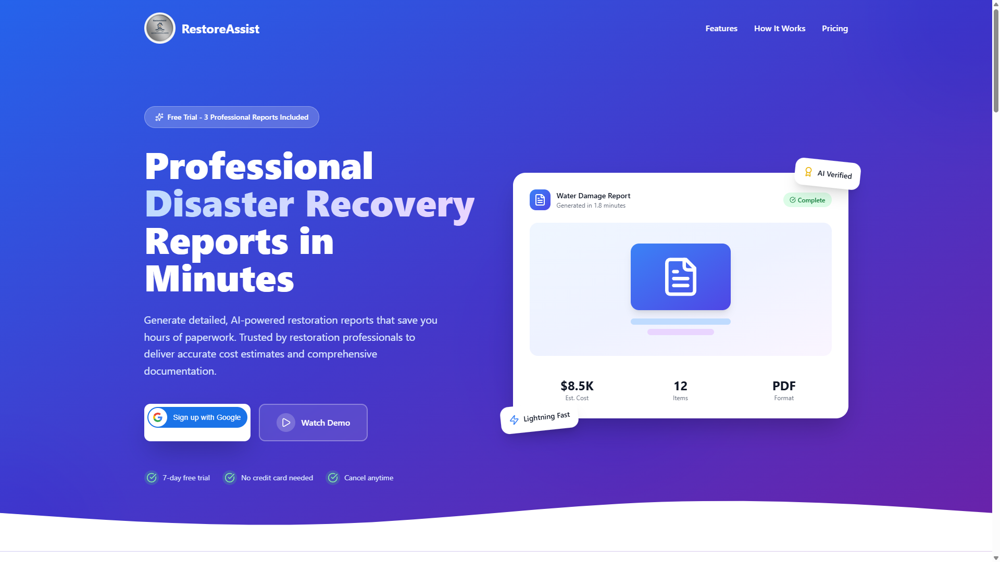
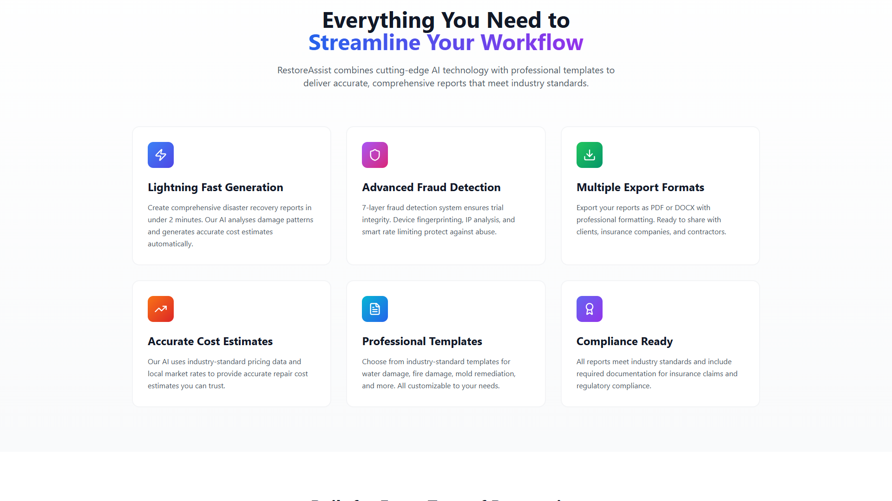
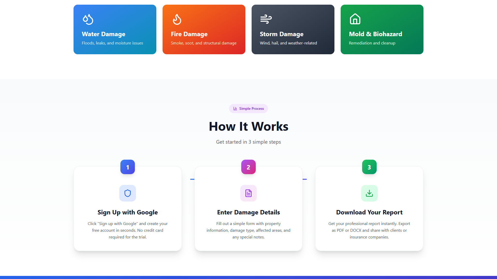
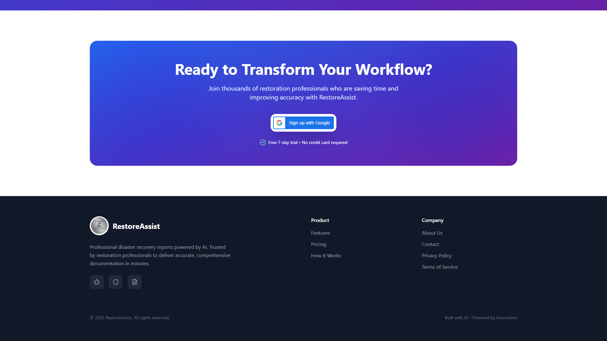

# RestoreAssist User Guide

**Version**: 1.0
**Last Updated**: October 20, 2025
**For**: Restoration Professionals, Insurance Assessors, Property Managers

---

## Table of Contents

1. [Introduction](#introduction)
2. [Getting Started](#getting-started)
3. [Creating Your First Report](#creating-your-first-report)
4. [Understanding Report Types](#understanding-report-types)
5. [Features Overview](#features-overview)
6. [Pricing Plans](#pricing-plans)
7. [Best Practices](#best-practices)
8. [Troubleshooting](#troubleshooting)
9. [FAQ](#faq)

---

## Introduction

Welcome to **RestoreAssist**, your AI-powered disaster recovery reporting solution. RestoreAssist streamlines the process of creating professional, comprehensive restoration reports for Australian properties affected by water damage, fire, storms, mold, and other disasters.

### What RestoreAssist Does

RestoreAssist combines cutting-edge AI technology with professional templates to deliver:

- **Lightning-fast report generation** - Complete reports in under 2 minutes
- **Accurate cost estimates** - Using industry-standard pricing and local market rates
- **Professional documentation** - Export to PDF or DOCX formats
- **NCC 2022 compliance** - All reports meet Australian building standards
- **Advanced fraud detection** - 7-layer protection system

---

## Getting Started

### System Requirements

- **Browser**: Chrome, Firefox, Safari, or Edge (latest version)
- **Internet**: Stable connection required
- **Google Account**: For authentication and trial activation

### Step 1: Create Your Account

1. Navigate to [http://localhost:5174](http://localhost:5174) (or your production URL)
2. Click the **"Sign up with Google"** button
3. Select your Google account
4. Grant necessary permissions
5. You'll be automatically logged in

**Benefits of Google Sign-In:**
- No password to remember
- Secure OAuth 2.0 authentication
- Instant account activation
- Automatic profile setup

### Step 2: Activate Free Trial

Upon first login, you'll receive:
- **7-day free trial**
- **3 professional reports** included
- **Full access** to all features
- **No credit card** required

---

## Creating Your First Report

### The 3-Step Process

#### Step 1: Sign Up with Google
- Click "Sign up with Google"
- Create your free account in seconds
- No credit card required for trial

#### Step 2: Enter Damage Details
Fill out the simple form with:
- **Property Information**: Address, type, age
- **Damage Type**: Water, fire, storm, mold, etc.
- **Affected Areas**: Rooms, square footage
- **Special Notes**: Any additional context

#### Step 3: Download Your Report
- Get your professional report instantly
- Export as PDF or DOCX
- Share with clients or insurance companies

### Report Generation Form

When creating a report, you'll provide:

**Property Details:**
- Street address
- Suburb/City
- State
- Postcode
- Property type (residential, commercial)
- Year built
- Construction type

**Damage Information:**
- Damage type (from dropdown)
- Severity level (minor, moderate, severe, catastrophic)
- Affected rooms (checklist)
- Total affected area (m²)
- Date of incident
- Cause of damage

**Additional Context:**
- Insurance claim number (optional)
- Photos/documentation (optional)
- Special considerations
- Urgent repairs needed

---

## Understanding Report Types

RestoreAssist supports multiple damage categories, each with specialized templates:

### 1. Water Damage
**Typical Cost Range**: $2,000 - $15,000+

**Covers:**
- Floods and leaks
- Moisture damage
- Structural drying
- Mold prevention
- Water extraction
- Dehumidification

**Report Includes:**
- Water source identification
- Affected materials assessment
- Drying equipment requirements
- Timeline for restoration
- Moisture readings

### 2. Fire Damage
**Typical Cost Range**: $10,000 - $100,000+

**Covers:**
- Smoke damage
- Soot contamination
- Structural damage
- Odor removal
- Content restoration

**Report Includes:**
- Fire severity assessment
- Structural integrity evaluation
- Smoke/soot penetration analysis
- Hazardous material identification
- Rebuild requirements

### 3. Storm Damage
**Typical Cost Range**: $5,000 - $50,000+

**Covers:**
- Wind damage
- Hail impact
- Weather-related issues
- Roof repairs
- Window replacement

**Report Includes:**
- Structural damage assessment
- Roof and exterior evaluation
- Water ingress points
- Emergency repairs needed
- Long-term restoration plan

### 4. Mold & Biohazard
**Typical Cost Range**: $3,000 - $30,000+

**Covers:**
- Mold remediation
- Biohazard cleanup
- Contamination removal
- Air quality testing
- Prevention measures

**Report Includes:**
- Mold species identification
- Affected area mapping
- Containment requirements
- Remediation protocol
- Prevention recommendations

---

## Features Overview

### Lightning Fast Generation
⚡ **Under 2 Minutes**
- AI analyses damage patterns instantly
- Generates accurate cost estimates automatically
- No manual calculations required

### Advanced Fraud Detection
🛡️ **7-Layer Protection**
- Device fingerprinting
- IP analysis
- Smart rate limiting
- Trial integrity protection
- Abuse prevention

### Multiple Export Formats
📄 **PDF & DOCX**
- Professional formatting
- Ready to share instantly
- Compatible with all platforms
- Customizable templates

### Accurate Cost Estimates
💰 **Industry-Standard Pricing**
- Local market rates
- Regional price variations
- Material costs (2025)
- Labour rates
- Equipment hire

### Professional Templates
📋 **Industry Standards**
- NCC 2022 compliant
- Insurance-ready
- Fully customizable
- Professional presentation
- Comprehensive documentation

### Compliance Ready
✅ **Regulatory Requirements**
- Meets industry standards
- Insurance claim documentation
- Building code compliance
- Legal requirements
- Audit trail

---

## Pricing Plans

### Free Trial (Most Popular)
**$0 for 7 days**

**Includes:**
- ✅ 3 professional reports
- ✅ PDF & DOCX export formats
- ✅ AI-powered cost estimates
- ✅ All professional templates
- ✅ No credit card required
- ✅ Cancel anytime, hassle-free

**Perfect For:**
- Testing the platform
- Small projects
- One-off assessments
- Evaluating features

**How to Sign Up:**
1. Click "Sign up with Google"
2. Complete Google authentication
3. Start generating reports immediately

---

## Best Practices

### Creating Accurate Reports

**1. Gather Complete Information**
- Take comprehensive photos
- Measure affected areas precisely
- Document all visible damage
- Note timestamps and dates
- Include insurance details

**2. Select Correct Damage Type**
- Choose the primary damage category
- Note secondary damage types
- Assess severity accurately
- Consider long-term impacts

**3. Provide Detailed Context**
- Explain incident circumstances
- Note emergency measures taken
- Identify safety hazards
- Document previous damage history

**4. Review Before Finalizing**
- Check all measurements
- Verify cost estimates
- Ensure accuracy of details
- Confirm compliance requirements

### Report Management

**Organize Your Reports:**
- Use consistent naming conventions
- Tag by property address
- Include date in filename
- Store backups securely

**Sharing Reports:**
- Export to appropriate format (PDF for insurance, DOCX for editing)
- Include all supporting photos
- Send via secure methods
- Keep distribution records

---

## Troubleshooting

### Common Issues and Solutions

#### Issue: Google Sign-In Not Working

**Symptoms:**
- Google popup doesn't appear
- Error: "The given origin is not allowed"
- 403 Forbidden errors

**Solutions:**
1. Clear browser cache and cookies
2. Try incognito/private browsing mode
3. Ensure JavaScript is enabled
4. Check if third-party cookies are allowed
5. Try a different browser

**If issue persists:**
- Contact support with error details
- Provide browser console logs (F12 → Console)

#### Issue: Report Generation Fails

**Symptoms:**
- Error during report creation
- Stuck on "Generating..." screen
- Timeout errors

**Solutions:**
1. Check internet connection
2. Verify all required fields are filled
3. Reduce file sizes of uploaded photos
4. Try again in a few minutes
5. Clear browser cache

#### Issue: Export Not Working

**Symptoms:**
- Download doesn't start
- Corrupted file
- Missing content in export

**Solutions:**
1. Check browser download settings
2. Disable popup blockers
3. Try different export format (PDF vs DOCX)
4. Ensure sufficient disk space
5. Try downloading in incognito mode

#### Issue: Cost Estimates Seem Incorrect

**Symptoms:**
- Estimates too high or too low
- Missing items in cost breakdown

**Solutions:**
1. Verify you selected correct damage type
2. Check severity level is accurate
3. Ensure affected area is measured correctly
4. Review regional pricing settings
5. Contact support for cost review

---

## FAQ

### General Questions

**Q: How accurate are the cost estimates?**
A: RestoreAssist uses industry-standard pricing databases updated with 2025 market rates. Estimates are typically within 10-15% of actual costs, but final quotes should always be provided by licensed contractors.

**Q: Can I edit reports after generation?**
A: Yes! Export to DOCX format for full editing capabilities in Microsoft Word or compatible software.

**Q: Are reports legally binding?**
A: Reports serve as professional assessments and documentation. They should be reviewed by licensed professionals before being used for contracts or legal purposes.

**Q: What makes RestoreAssist different from manual reports?**
A: AI-powered analysis, instant generation (2 mins vs 2 hours), consistent formatting, NCC 2022 compliance, and accurate cost calculations based on current market data.

### Trial & Subscription

**Q: What happens after my free trial ends?**
A: After 7 days or 3 reports (whichever comes first), you'll need to subscribe to continue. All existing reports remain accessible.

**Q: Can I cancel my trial?**
A: Yes, anytime. No credit card is required for the trial, so there's nothing to cancel. Simply stop using the service.

**Q: Is there a monthly subscription available?**
A: Subscription plans are coming soon. Currently, the free trial includes 3 professional reports.

**Q: Do unused reports roll over?**
A: No, the free trial includes 3 reports to be used within the 7-day period.

### Technical Questions

**Q: What browsers are supported?**
A: Chrome, Firefox, Safari, and Edge (latest versions). Mobile browsers are supported but desktop is recommended for best experience.

**Q: Can I use RestoreAssist offline?**
A: No, an internet connection is required for report generation and AI processing.

**Q: Where is my data stored?**
A: All data is securely stored on Supabase (PostgreSQL) servers in Australia with enterprise-grade encryption.

**Q: Can I integrate RestoreAssist with my existing software?**
A: API integration is planned for future releases. Contact sales for early access information.

### Report Questions

**Q: Can I add my company branding to reports?**
A: Custom branding is planned for premium tiers. Currently, reports use standard professional templates.

**Q: How long does report generation take?**
A: Typically under 2 minutes. Complex reports with extensive damage may take slightly longer.

**Q: Can I generate multiple reports for the same property?**
A: Yes, you can create multiple reports (e.g., initial assessment, follow-up, final documentation).

**Q: What format should photos be?**
A: JPG, PNG, or HEIC. Maximum 10MB per photo. We recommend clear, well-lit images showing damage from multiple angles.

---

## Support & Contact

### Getting Help

**Email Support**: support@restoreassist.com
**Response Time**: Within 24 hours (business days)

**Documentation**: [https://docs.restoreassist.com](https://docs.restoreassist.com)
**Status Page**: [https://status.restoreassist.com](https://status.restoreassist.com)

### Report a Bug

If you encounter issues:
1. Note the exact error message
2. Take a screenshot if possible
3. Note what you were doing when the error occurred
4. Email support@restoreassist.com with details

### Feature Requests

We welcome feedback! Submit feature requests to:
- Email: features@restoreassist.com
- Include: Description, use case, priority

---

## Glossary

**NCC 2022**: National Construction Code 2022 - Australian building standards
**DOCX**: Microsoft Word document format
**PDF**: Portable Document Format
**OAuth 2.0**: Secure authentication protocol
**AI**: Artificial Intelligence
**m²**: Square metres (area measurement)
**JWT**: JSON Web Token (authentication)
**API**: Application Programming Interface

---

## Version History

### Version 1.0 (October 2025)
- Initial release
- Google authentication
- Report generation for 4 damage types
- PDF/DOCX export
- Free trial (7 days, 3 reports)
- NCC 2022 compliance
- Advanced fraud detection

---

## Legal & Compliance

### Terms of Service

By using RestoreAssist, you agree to:
- Use reports for professional purposes only
- Verify critical information with licensed professionals
- Not share account credentials
- Comply with applicable laws and regulations

### Privacy Policy

RestoreAssist respects your privacy:
- Data encrypted in transit and at rest
- No data sold to third parties
- GDPR/Privacy Act compliant
- Regular security audits

### Disclaimers

**Professional Advice**: Reports are for informational purposes. Always consult licensed professionals for final decisions.

**Cost Estimates**: Estimates are based on current market data but may vary. Actual costs depend on specific circumstances, contractor rates, and material availability.

**Liability**: RestoreAssist is not liable for decisions made based on report information. Reports should be reviewed by qualified professionals.

---

## Acknowledgments

RestoreAssist is built with:
- **AI Technology**: Claude 3.5 (Anthropic)
- **Frontend**: React + TypeScript + Tailwind CSS
- **Backend**: Node.js + Express + PostgreSQL
- **Authentication**: Google OAuth 2.0
- **Hosting**: Vercel + Supabase
- **Standards**: NCC 2022, Australian Building Codes

---

**© 2025 RestoreAssist. All rights reserved.**

**Built with AI • Powered by Innovation**

---

*For the latest version of this guide, visit: [https://docs.restoreassist.com/user-guide](https://docs.restoreassist.com/user-guide)*
